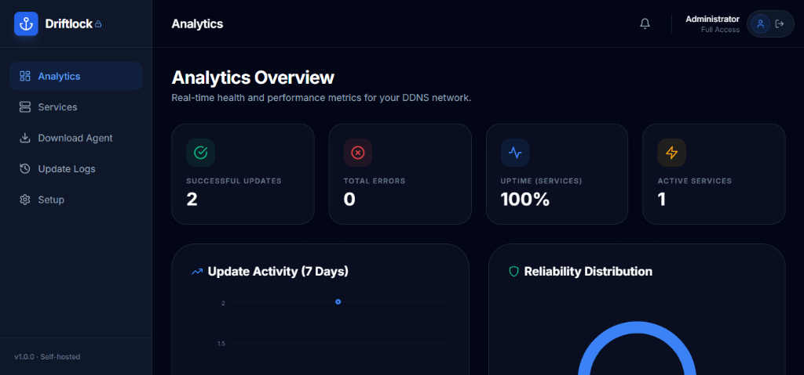
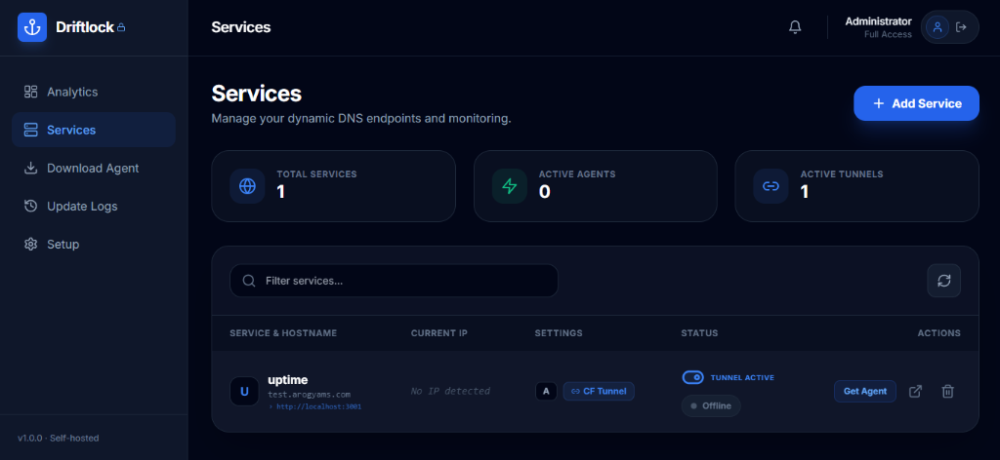
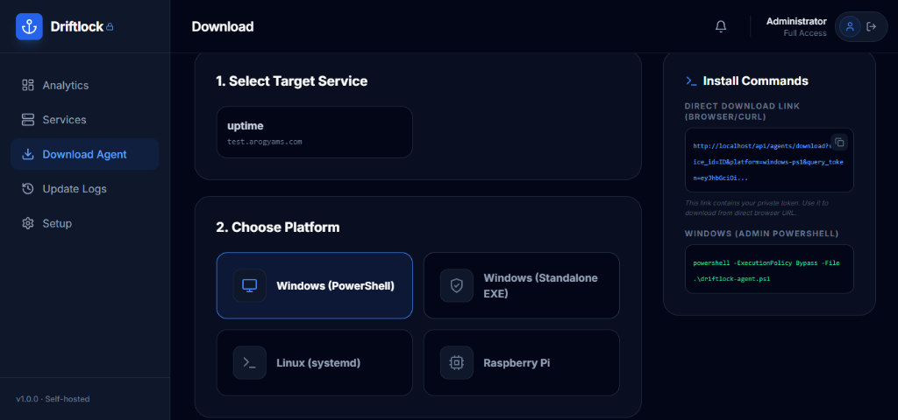

<div align="center">

```
     ██████╗  ██████╗  ██╗ ███████╗ ████████╗ ██╗      ██████╗   ██████╗ ██╗  ██╗
     ██╔══██╗ ██╔══██╗ ██║ ██╔════╝ ╚══██╔══╝ ██║     ██╔═══██╗ ██╔════╝ ██║ ██╔╝
     ██║  ██║ ██████╔╝ ██║ █████╗      ██║    ██║     ██║   ██║ ██║      █████╔╝
     ██║  ██║ ██╔══██╗ ██║ ██╔══╝      ██║    ██║     ██║   ██║ ██║      ██╔═██╗
     ██████╔╝ ██║  ██║ ██║ ██║         ██║    ███████╗ ╚██████╔╝ ╚██████╗ ██║  ██╗
     ╚═════╝  ╚═╝  ╚═╝ ╚═╝ ╚═╝         ╚═╝    ╚══════╝  ╚═════╝   ╚═════╝ ╚═╝  ╚═╝
                              ⚓ YOUR DNS. LOCKED DOWN. ⚓
```

### Self-hosted DDNS with a beautiful GUI. Your domain. Your server. Zero subscriptions.

[](LICENSE)
[](https://hub.docker.com/r/shinchangupta/driftlock)
[](https://github.com/shinchan1907/driftlock)
[](https://github.com/shinchan1907/driftlock)
[](https://github.com/shinchan1907/driftlock)
[](https://fastapi.tiangolo.com)
[](https://reactjs.org)

---

**Tired of your home server going offline every time your ISP changes your IP?** Tired of ugly subdomains like `yourname.duckdns.org`? Tired of editing `ddclient.conf` files that haven't been redesigned since the Bush administration?

**Driftlock fixes this** — silently, automatically, with a dashboard that doesn't look like it was built in 2003. Point your own domain at your server, install a lightweight agent, and never think about dynamic DNS again.

🏠 **Used by 100+ homelabbers worldwide** · ⭐ **Star us to help more people find Driftlock**

</div>

---

## ✨ See It In Action

<div align="center">
  
  <p><i>Real-time insights and network health via the Analytics Overview</i></p>
  
  <br>
  
  
  <p><i>Manage secure Tunnels and traditional DDNS in one place</i></p>

  <br>
  
  
  <p><i>One-click pre-configured agent installers for all platforms</i></p>
</div>

📹 **Full demo video:** [Watch on YouTube](#)

---

## 🤔 Why Driftlock?

| Feature | **Driftlock** | DuckDNS | No-IP | Cloudflare Tunnel |
|:--------|:---:|:---:|:---:|:---:|
| Use **your own domain** | ✅ | ❌ | ⚠️ Paid only | ✅ |
| Beautiful GUI dashboard | ✅ | ❌ | ⚠️ Basic | ❌ |
| Multi-device support | ✅ | ✅ | ⚠️ Limited | ✅ |
| Agent auto-installer (Win + Linux) | ✅ | ❌ | ⚠️ Windows | ❌ |
| **No Port Forwarding needed** | ✅ | ❌ | ❌ | ✅ |
| Analytics & uptime tracking | ✅ | ❌ | ❌ | ❌ |
| Filterable audit logs | ✅ | ❌ | ❌ | ❌ |
| Docker one-command deploy | ✅ | N/A | N/A | ❌ |
| Auto SSL (Let's Encrypt) | ✅ | N/A | N/A | N/A |
| Open source | ✅ | ✅ | ❌ | ✅ |
| **Monthly cost** | **$3.50** (VPS) | Free | $0–25 | Free |

**Bottom line:** Driftlock is now a complete **Edge Orchestration Suite**. Whether you need classic Dynamic DNS for direct IP access or **Cloudflare Tunnels** to expose web services without opening firewall ports, Driftlock handles it all through a single, stunning dashboard.

---

## 🚀 Features

### 🖥️ Dashboard & Management

- **Beautiful dark-themed React UI** — designed to feel premium, not like a weekend project
- **Cloudflare Tunnel Integration** — expose local services (e.g. `http://localhost:3000`) securely without port forwarding
- **Service management** with live status, tunnel health, and one-click API key rotation
- **Filterable audit logs** — search by service, status, IP, or date range
- **Advanced Analytics** — Network distribution pie charts, 24h hourly traffic trends, and system health monitor

### 🤖 Smart Agents

- **Windows PowerShell** (`.ps1`) — scheduled task + system tray icon with context menu
- **Windows Executable** (`.exe`) — standalone binary, no PowerShell knowledge required
- **Linux / Raspberry Pi** (`.sh`) — systemd service + timer, runs as dedicated non-root user
- **All agents include:**
  - 3-fallback IP detection (`ipify.org` → `ifconfig.me` → `icanhazip.com`)
  - Auto-retry with exponential backoff
  - Local log rotation (capped at 1000 lines)
  - Config pre-baked at download time — run the installer and forget about it

### 🔒 Security

- **JWT authentication** with 15-minute access tokens + 7-day refresh tokens
- **Cloudflare API token encrypted at rest** with AES-256-GCM (PBKDF2-derived key)
- **Token never returned to the browser** after initial save — it's write-only
- **Per-service UUIDv4 API keys** — rotate any service key without affecting others
- **Rate limiting** on all endpoints (60 req/min API, separate limit for agent updates)
- **Non-root Docker containers** — both backend and nginx run as unprivileged users
- **HTTPS enforced** with HSTS, X-Frame-Options DENY, and strict CSP headers

---

## ⚡ Quick Start

### Prerequisites

- [ ] A domain managed by [Cloudflare](https://cloudflare.com) (free tier works perfectly)
- [ ] A [Cloudflare API token](https://dash.cloudflare.com/profile/api-tokens) with **DNS:Edit** permission for your zone
- [ ] An [AWS Lightsail](https://lightsail.aws.amazon.com) instance (Ubuntu 22.04, **$3.50/mo**) or any Linux VPS
- [ ] Your domain's A record pointed at your server's public IP

### Option A — Single Docker command (easiest)
```bash
docker run -d \
  --name driftlock \
  --restart unless-stopped \
  -p 80:80 \
  -e ADMIN_PASSWORD=yourpassword \
  -v driftlock_data:/app/data \
  shinchangupta/driftlock:latest
```
Open http://localhost — done.

### Option B — Docker Compose (recommended for production)
```bash
curl -O https://raw.githubusercontent.com/shinchan1907/DriftLock/main/docker-compose.hub.yml
curl -O https://raw.githubusercontent.com/shinchan1907/DriftLock/main/.env.example
cp .env.example .env
# Edit .env to set your password and domain
docker compose -f docker-compose.hub.yml up -d
```

### Option C — Build from source (for developers)
```bash
git clone https://github.com/shinchan1907/DriftLock.git
cd DriftLock
cp .env.example .env
docker compose up --build
```

```bash
git clone https://github.com/shinchan1907/driftlock.git
cd driftlock
cp .env.example .env         # defaults are ready for local dev
docker compose up --build    # override.yml auto-enables HTTP-only mode
```

Open [http://localhost](http://localhost) — login with `admin` / `admin123`.

---

## 📱 Adding Your First Device

**Total time: under 2 minutes.**

1. **Log in** to your dashboard at `https://yourdomain.com`

2. **Setup Cloudflare** — Go to **Setup** → paste your Cloudflare API token → click **Verify**. Your zones will be fetched automatically.

3. **Add a Service** — Go to **Services** → **Add Service** → pick a subdomain (e.g. `homepc`) and zone (e.g. `example.com`). This creates `homepc.example.com` pointing at your device's IP.

4. **Download the Agent** — Go to **Download Agent** → select the service → pick your platform → click **Download**. The installer comes pre-configured with your server URL and API/Tunnel keys baked in.

5. **Run the installer on your device:**

   **Windows (PowerShell):**
   ```powershell
   # 1. Open PowerShell as Administrator
   # 2. Run the downloaded script
   Set-ExecutionPolicy Bypass -Scope Process -Force; .\driftlock-agent-homepc.ps1
   ```
   *Note: For Tunnels, this automatically installs `cloudflared` as a Windows Service.*

   **Linux / Raspberry Pi (Bash):**
   ```bash
   # 1. Make the script executable
   chmod +x driftlock-agent-homeserver.sh
   # 2. Run with sudo to install systemd service
   sudo ./driftlock-agent-homeserver.sh
   ```

6. **Done.** Your service is now live! 
   - **DDNS Mode**: DNS record updates within seconds of IP changes.
   - **Tunnel Mode**: Your local service is now public at `https://subdomain.yourdomain.com` without any port forwarding.

---

## 🏗️ Architecture

```
┌──────────────────────────────────────────────────────┐
│                Your VPS / Lightsail                   │
│                                                       │
│   ┌───────────┐     ┌────────────┐    ┌───────────┐  │
│   │   Nginx   │────▶│  FastAPI   │───▶│  SQLite   │  │
│   │  + TLS    │     │  Backend   │    │ Database  │  │
│   │  + Rate   │     │  (async)   │    │  (WAL)    │  │
│   │  Limiting │     └─────┬──────┘    └───────────┘  │
│   └─────┬─────┘           │                          │
│         │            ┌────▼──────┐                   │
│   ┌─────▼─────┐      │Cloudflare │                   │
│   │  React    │      │   API     │                   │
│   │  SPA      │      │ (DNS Ops) │                   │
│   └───────────┘      └───────────┘                   │
│                                                       │
└──────────────────────────────────────────────────────┘
         ▲                        ▲
         │ HTTPS                  │ HTTPS
         │                        │
┌────────┴────────┐    ┌──────────┴──────────┐
│  Your Browser   │    │   Your Devices       │
│  (Dashboard)    │    │   Win / Linux / Pi   │
└─────────────────┘    │                      │
                       │  POST /api/update    │
                       │  every 5 min         │
                       │  with X-API-Key      │
                       └──────────────────────┘
```

**How an update works:**
1. Agent detects public IP via `api.ipify.org` (with 2 fallbacks)
2. Compares with last known IP stored locally
3. If changed → `POST /api/update` with the new IP and service API key
4. Backend validates the key, calls Cloudflare API to update the DNS record
5. Logs the event (success, no_change, or error) with full metadata
6. Dashboard shows the update in real time on the Logs and Analytics pages

---

## ⚙️ Configuration

All configuration is done through environment variables in `.env`:

### Core

| Variable | Required | Default | Description |
|:---------|:--------:|:--------|:------------|
| `ENVIRONMENT` | No | `development` | `development` or `production` |
| `SECRET_KEY` | **Yes** | — | Random 64-char hex string for JWT signing. Generate with `openssl rand -hex 32` |
| `DOMAIN` | **Yes** | `localhost` | Your domain (e.g. `ddns.example.com`) |
| `SERVER_URL` | No | `http://localhost` | Full URL agents use to reach your server (e.g. `https://ddns.example.com`) |

### Authentication

| Variable | Required | Default | Description |
|:---------|:--------:|:--------|:------------|
| `ADMIN_USERNAME` | **Yes** | `admin` | Dashboard login username |
| `ADMIN_PASSWORD` | **Yes** | — | Dashboard login password. Set on first startup, used to create the admin account |
| `ACCESS_TOKEN_EXPIRE_MINUTES` | No | `15` | JWT access token lifetime in minutes |
| `REFRESH_TOKEN_EXPIRE_DAYS` | No | `7` | JWT refresh token lifetime in days |

### Database & Encryption

| Variable | Required | Default | Description |
|:---------|:--------:|:--------|:------------|
| `DATABASE_URL` | No | `sqlite+aiosqlite:////app/data/driftlock.db` | SQLite database path (inside Docker volume) |
| `ENCRYPTION_SALT` | **Yes** | — | Random 32-char hex for AES key derivation. Generate with `openssl rand -hex 16` |

### CORS & Rate Limiting

| Variable | Required | Default | Description |
|:---------|:--------:|:--------|:------------|
| `CORS_ORIGINS` | No | `http://localhost,http://localhost:3000` | Comma-separated allowed origins |
| `UPDATE_RATE_LIMIT` | No | `60/minute` | Rate limit for agent update endpoint |
| `LOGIN_RATE_LIMIT` | No | `5/minute` | Rate limit for login endpoint |

### Agent

| Variable | Required | Default | Description |
|:---------|:--------:|:--------|:------------|
| `AGENT_VERSION` | No | `1.0.0` | Version string embedded in downloaded agents |

---

## 🔄 Updating Driftlock

```bash
cd driftlock
git pull origin main
docker compose down
docker compose up --build -d
```

Database migrations run automatically on startup — your data is preserved across updates. The SQLite database lives in a Docker volume (`sqlite_data`) that persists independently of container rebuilds.

---

## 🏠 Running Without a Domain (Local / LAN Only)

If you want to run Driftlock on a local network without a public domain or SSL:

1. The project includes a `docker-compose.override.yml` that automatically activates for local development
2. It replaces the SSL nginx config with a plain HTTP config on port 80
3. No certificates or domain required — just `docker compose up --build`

```bash
# Local dev is the default — no extra flags needed
cp .env.example .env
docker compose up --build
# Open http://localhost
```

For production with a real domain, use the explicit production compose file:

```bash
docker compose -f docker-compose.yml -f docker-compose.prod.yml up -d
```

---

## 🔧 Troubleshooting

| Problem | Likely Cause | Fix |
|:--------|:-------------|:----|
| Dashboard shows blank page | Frontend build didn't complete | Run `docker compose run --rm frontend` then restart nginx |
| SSL certificate failed | Domain not pointed at server IP, or port 80 blocked | Verify DNS A record, check `ufw allow 80` and `ufw allow 443` |
| Agent can't connect to server | Wrong `SERVER_URL` in .env, or firewall blocking | Ensure `SERVER_URL=https://yourdomain.com` and ports 80/443 are open |
| "Invalid Cloudflare token" | Token doesn't have DNS:Edit permission | Create a new token at Cloudflare dashboard with Zone → DNS → Edit for your zone |
| DNS not updating despite success in logs | Cloudflare DNS propagation delay | Wait 1–5 minutes. Check Cloudflare dashboard directly. Try `dig +short yoursubdomain.example.com` |
| Containers keep restarting | Check logs with `docker compose logs backend` | Usually a config error — look for the Python traceback and fix the .env value |
| Forgot admin password | No password reset UI yet | Delete the SQLite database and restart: `docker volume rm driftlock_sqlite_data && docker compose up -d` |
| `bcrypt` version error on startup | passlib/bcrypt version mismatch | Ensure `requirements.txt` has `bcrypt==4.0.1` and `passlib[bcrypt]==1.7.4` |
| CORS error in browser console | `CORS_ORIGINS` doesn't include your frontend URL | Add your domain to `CORS_ORIGINS` in `.env` (comma-separated, no quotes) |

---

## 🗺️ Roadmap

### ✅ Already Built

- [x] Cloudflare Tunnel integration (Zero-config web access)
- [x] Advanced Analytics (Hourly traffic + Network distribution)
- [x] Windows PowerShell agent with auto-elevation
- [x] Windows EXE agent (pre-compiled binary)
- [x] Linux / Raspberry Pi agent with systemd integration
- [x] JWT authentication + AES-256-GCM encryption at rest
- [x] Docker one-command deploy with auto-SSL

### 🔜 Coming Soon

- [ ] **macOS agent** — LaunchDaemon with menu bar icon
- [ ] **Multi-provider support** — Route53, Namecheap, Porkbun, DigitalOcean DNS
- [ ] **Notifications** — Telegram / Discord / Email alerts on IP change or agent failure
- [ ] **Two-factor authentication** (TOTP) for dashboard login
- [ ] **Mobile app** — React Native companion for monitoring on the go
- [ ] **Kubernetes Helm chart** — for the overengineers among us
- [ ] **Dark / light theme toggle** — because some people like bright screens
- [ ] **Multi-user support** with role-based access control
- [ ] **Webhook support** — trigger custom actions on IP change events
- [ ] **Agent auto-update** — agents check for new versions and update themselves

Have a feature idea? [Open a discussion](https://github.com/shinchan1907/driftlock/discussions) — we'd love to hear it.

---

## 🤝 Contributing

All contributions are welcome — from typo fixes to major feature PRs. This project was built by someone who was tired of bad DDNS tools, and if you feel the same way, you'll fit right in.

### Getting Started

```bash
# Clone and start the full stack locally
git clone https://github.com/shinchan1907/driftlock.git
cd driftlock
cp .env.example .env

# Start backend + nginx (uses local HTTP override automatically)
docker compose up --build

# In a second terminal — frontend dev server with hot reload
cd frontend
npm install
npm run dev
# Frontend dev server runs at http://localhost:5173
# API requests proxy to the backend container automatically
```

### Where to Start

- 🏷️ Check out issues tagged [**good first issue**](https://github.com/shinchan1907/driftlock/labels/good%20first%20issue) — these are specifically scoped for new contributors
- 📖 Read the [CONTRIBUTING.md](CONTRIBUTING.md) for code style and PR guidelines
- 💬 Join the [Discussions](https://github.com/shinchan1907/driftlock/discussions) to ask questions before diving in

### Project Structure

```
driftlock/
├── backend/                 # FastAPI application
│   ├── app/
│   │   ├── config.py        # Pydantic settings
│   │   ├── main.py          # App entrypoint, CORS, startup
│   │   ├── models.py        # SQLAlchemy ORM models
│   │   ├── schemas.py       # Pydantic request/response schemas
│   │   ├── security.py      # JWT, bcrypt, AES-256 encryption
│   │   ├── cloudflare.py    # Async Cloudflare API client
│   │   ├── agent_generator.py  # Template substitution engine
│   │   └── routers/         # API route handlers
│   ├── Dockerfile
│   └── requirements.txt
├── frontend/                # React 18 + Vite + TailwindCSS
│   ├── src/
│   │   ├── pages/           # Login, Setup, Services, Download, Logs, Analytics
│   │   ├── components/      # Sidebar, Topbar, AppShell
│   │   └── api/client.ts    # Axios with JWT interceptor
│   └── Dockerfile
├── agent-builder/           # Agent templates + build tooling
│   └── templates/           # .sh, .ps1, .py templates with {{PLACEHOLDERS}}
├── nginx/                   # Nginx config templates (envsubst)
├── docker-compose.yml       # Production stack
├── docker-compose.override.yml  # Local dev (HTTP, no SSL)
├── setup.sh                 # One-command bootstrap script
└── .env.example             # All configuration variables
```

---

## 💬 Community & Support

- 🐛 **Found a bug?** [Open an issue](https://github.com/shinchan1907/driftlock/issues)
- 💡 **Have an idea?** [Start a discussion](https://github.com/shinchan1907/driftlock/discussions)
- 📣 **Want to share your setup?** Post in [Show & Tell](https://github.com/shinchan1907/driftlock/discussions/categories/show-and-tell)

> **If Driftlock saved you money or headaches, consider giving it a ⭐** — it costs you nothing and helps more self-hosters discover the project. Every star genuinely makes a difference for open source visibility.

---

## 📈 Star History


[](https://star-history.com/#shinchan1907/driftlock&Date)

---

## 🙏 Acknowledgements

Built on the shoulders of excellent open source projects:

- [FastAPI](https://fastapi.tiangolo.com) — the best Python web framework, period
- [React](https://react.dev) — UI library that actually scales
- [Vite](https://vitejs.dev) — build tooling that doesn't waste your time
- [TailwindCSS](https://tailwindcss.com) — CSS that makes you productive instead of frustrated
- [Nginx](https://nginx.org) — battle-tested reverse proxy
- [Let's Encrypt](https://letsencrypt.org) — free SSL for everyone
- [Cloudflare](https://cloudflare.com) — DNS API that just works
- [Recharts](https://recharts.org) — beautiful charts for React

Inspired by the collective frustration of everyone who has ever tried to configure `ddclient`, wondered why their No-IP hostname expired *again*, or settled for a `duckdns.org` subdomain when they deserved better.

---

<div align="center">

**Made with ☕ and the belief that self-hosting should be beautiful.**

If you've been running ddclient scripts for years and want something better — give Driftlock a try and [let us know what you think](https://github.com/shinchan1907/driftlock/discussions).

---

MIT License — Copyright © 2025 Driftlock Contributors

Free for personal and commercial use. See [LICENSE](LICENSE) for details.

</div>
